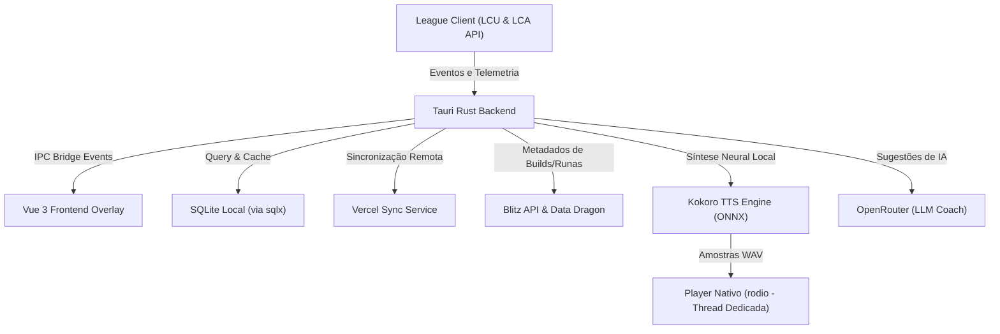

# ⚡ Spell Coach IA

> O seu treinador virtual de **League of Legends** em tempo real, movido por Inteligência Artificial, análise de macro/micro no High-ELO e Síntese de Voz Neural Local.

---

**Spell Coach IA** é um overlay e assistente avançado em tempo real para League of Legends construído sobre a tecnologia **Tauri v2**, **Vue 3 (TypeScript)** e **Rust**. Ele se conecta diretamente ao cliente do jogo (via LCU e Live Client API) para monitorar sua partida, calcular o melhor caminho de farm/selva, sugerir a ordem ideal de evolução de habilidades e ditar dicas estratégicas dinâmicas usando **voz neural processada localmente por Inteligência Artificial**.

---

## 🗺️ Visão Geral da Arquitetura

O projeto divide-se em um frontend reativo projetado para rodar como um overlay de baixíssima latência e um backend de alta performance escrito em Rust que coordena serviços de banco de dados local, conexões de API e processamento de áudio em tempo real.



---

## 🚀 Principais Recursos e Funcionalidades

### 1. 🎙️ Motor de Voz Neural Local (Kokoro TTS)
Diga adeus às vozes robóticas de navegadores! O Spell Coach IA integra o modelo de voz neural **Kokoro** rodando de forma **100% local** via ONNX Runtime no Rust.
* **Aquecimento Rápido (Warm-up):** O motor realiza inferências de preparação ao iniciar para garantir que a voz toque instantaneamente no meio da partida.
* **Player Nativo (`VoicePlayer`):** Roda em uma thread exclusiva do Rust utilizando a biblioteca `rodio`, reproduzindo vozes instantaneamente sem causar travamentos ou travamento de quadros (frame-drop) no seu jogo.
* **Cache Inteligente de Voz:** Todas as falas geradas pela IA são salvas em um banco de dados SQLite e no disco local em formato `.wav` para economia de CPU.
* **Autolimpeza (Garbage Collector):** Uma rotina assíncrona limpa arquivos de voz expirados com mais de 7 dias automaticamente.

### 2. 🧠 Treinamento e Análise Macro/Micro-Game
O módulo `live_coach.rs` gerencia alertas cirúrgicos baseados em telemetria avançada de jogo:
* **Guia de Rota de Selva (Jungle Clear):** Analisa o campeão (se é focado em Dano Físico ou Poder de Habilidade/Mana) e o lado do mapa (Ordem/Caos) para guiar o caçador passo a passo pelo campo de monstros ideal, indicando exatamente quando caitar e usar o Smite.
* **Controle de Telemetria Invisível:** Estima a posição de oponentes ocultos na Névoa de Guerra (Fog of War) medindo oscilações nas estatísticas de vida, nível e CS detectadas pela API interna.
* **Evolução de Habilidades (Level-Up Coach):** Recomenda a distribuição ideal de pontos de habilidade (Q, W, E, R) com base nas prioridades e combos de cada campeão, notificando o momento exato em que você alcança picos de poder (como os níveis 6, 11 e 16).
* **Alertas Personalizados por Rota:** Dicas contextualizadas para **Top**, **Jungle**, **Mid**, **ADC** e **Support** (como avisos de recall por ouro acumulado, kiting, controle de visão no rio e avanço de torres).

### 3. 🖥️ Interface Overlay Multi-Janelas Dinâmica
Usando a flexibilidade do Tauri v2 e do Vue 3, o Spell Coach IA controla várias janelas leves de overlay que se posicionam perfeitamente na tela:
* **Janela Principal (Main Bar):** Barra minimalista e arrastável no topo da tela com o status do invocador e conexão do cliente.
* **Barra de Builds (Build Window):** Exibe a rota de compra ideal de itens e status dinâmicos.
* **Widget de Flashcards (Dicas Rápidas):** Janela flutuante animada com transição deslizante contendo dados estratégicos e raridades.
* **Overlay de Runas (Rune Overlay):** Exibe as árvores de runas recomendadas de forma não-intrusiva.
* **Visualizador de Estatísticas (Data Viewer Window):** Exibe perfis, gráficos avançados e análises de desempenho geradas pela IA.

### 4. 🗃️ Banco de Dados e Sincronização
* **SQLite nativo no Rust:** Gerenciamento robusto de dados históricos usando `sqlx` assíncrono.
* **Sincronizador Vercel (`vercel_sync_service`):** Permite subir counters, rotas de builds customizadas e telemetrias para nuvem em tempo real.
* **Serviço Blitz (`blitz_service`):** Integra-se com as recomendações, runas e builds do Blitz.gg para enriquecer o banco de dados.
* **Data Dragon Hidratado (`ddragon.rs`):** Mantém campeões, itens, feitiços de invocador e runas sempre sincronizados com a última atualização oficial da Riot Games.

---

## 🛠️ Tecnologias Utilizadas

### Frontend:
* **Framework:** [Vue 3](https://vuejs.org/) (SFC com `<script setup>`)
* **Linguagem:** [TypeScript](https://www.typescriptlang.org/)
* **Build Tool:** [Vite](https://vitejs.dev/)
* **Estilização:** Vanilla CSS (Aparência premium com efeitos de desfoque, glassmorphism e cores inspiradas no estilo Hextech)

### Backend:
* **Linguagem:** [Rust](https://www.rust-lang.org/)
* **Runtime de Janelas:** [Tauri v2](https://v2.tauri.app/)
* **Banco de Dados:** SQLite integrado via [sqlx](https://github.com/launchbadge/sqlx) (Rust) & `better-sqlite3` (scripts de dev/ferramentas)
* **Processamento de Voz:** ONNX Runtime via `kokoro_micro` e reprodução via `rodio`
* **Integrações:** APIs do League Client Update (LCU), Riot Games API, OpenRouter (IA LLM) e League Data Dragon

---

## 📂 Estrutura de Pastas do Projeto

```text
├── .vscode/                 # Configurações do VS Code
├── src/                     # CÓDIGO FONTE DO FRONTEND (Vue 3)
│   ├── assets/              # Imagens e mídias estáticas
│   ├── components/          # Componentes reutilizáveis (BuildWindow, SettingsWindow, etc.)
│   ├── composables/         # Composable useSpellCoach (Lógica modularizada)
│   ├── App.vue              # Componente raiz com roteador multi-janela dinâmico
│   ├── main.ts              # Inicialização do Vue
│   └── style.css            # Variáveis globais e paleta Hextech
│
├── src-tauri/               # CÓDIGO FONTE DO BACKEND (Rust)
│   ├── src/
│   │   ├── db/              # Camada de Dados (blitz, runes, matchup, vercel sync services)
│   │   ├── bridge.rs        # IPC Bridge de background para comunicação assíncrona
│   │   ├── ddragon.rs       # Hidratação e consumo de recursos do Data Dragon da Riot
│   │   ├── live_coach.rs    # Motor de análise tática, micro, clear de jungle e macros
│   │   ├── lcu.rs / lca.rs  # Conectores com as APIs locais de League of Legends
│   │   └── lib.rs           # Registro de comandos do Tauri e threads de Kokoro/Som
│   ├── Cargo.toml           # Dependências do ecossistema Rust
│   └── tauri.conf.json      # Configuração de Janelas, Permissões e Bundles do Tauri
│
├── package.json             # Scripts de execução e dependências JS/Vite
└── tsconfig.json            # Configuração de tipos TypeScript
```

---

## ⚙️ Pré-requisitos de Instalação

Antes de rodar o aplicativo, garanta que seu computador possui as seguintes ferramentas configuradas:

1. **Rust & Cargo:** Instale a ferramenta rustup para compilar o backend.
   * [Instalar Rust](https://www.rust-lang.org/tools/install)
2. **Node.js (v18+):** Necessário para gerenciar e executar o servidor de desenvolvimento do Vue.
   * [Instalar Node.js](https://nodejs.org/)
3. **Dependências do C++ (Windows):** Certifique-se de ter os builds tools do Visual Studio com suporte a C++ instalados (necessários para compilar o ONNX runtime e o driver de áudio).
4. **League of Legends Client:** O aplicativo consome telemetria ao vivo; logo, o jogo precisa estar aberto e em partida (ou no modo de treino) para que o Live Coaching funcione.

---

## 🏃 Como Executar o Projeto

> [!IMPORTANT]
> Na primeira inicialização, o motor de áudio **Kokoro** fará o download automático do modelo de voz neural de **~300MB+** diretamente na sua pasta local de AppData. Esse download é feito em background assíncrono para que o app abra normalmente enquanto faz o download.

### Passo 1: Instalar dependências
No terminal do projeto, execute:
```bash
npm install
```

### Passo 2: Executar em Modo de Desenvolvimento
Para abrir a interface do Tauri conectada ao servidor de desenvolvimento Vite com Hot Reload ativo:
```bash
npm run tauri dev
```

### Passo 3: Compilar para Produção (Build)
Para empacotar o projeto em um executável autônomo leve e otimizado (`.exe` no Windows):
```bash
npm run tauri build
```

---

## 🛠️ Variáveis de Ambiente (`.env`)

Crie um arquivo `.env` na raiz do projeto com base no arquivo `.env.example` para habilitar a inteligência de IA avançada via LLM:

```env
# Conexão com OpenRouter para dicas geradas por IA (Opcional)
OPENROUTER_API_KEY=sua_chave_aqui
OPENROUTER_MODEL=meta-llama/llama-3-8b-instruct:free

# Configurações de sincronização remota
VERCEL_SYNC_URL=sua_url_de_sincronizacao
```

---

## 💎 Créditos e Agradecimentos

Este projeto foi construído combinando tecnologias de ponta em desenvolvimento desktop, engenharia de áudio e telemetria de jogos. Agradecimentos especiais:
* À equipe do **Tauri** por fornecer um framework desktop incrivelmente leve.
* Ao projeto **Kokoro** pelo incrível modelo de voz neural leve e expressivo de código aberto.
* À **Riot Games** por fornecer APIs ricas que possibilitam a criação de ferramentas comunitárias focadas em aprendizado.

---
⚡ *Desenvolvido com carinho para ajudar a comunidade de League of Legends a melhorar a gameplay com tecnologia de ponta!*
